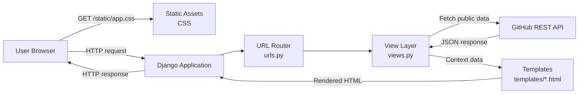

# GitHub Details Project Documentation

## Overview

GitHub Details is a Django web application that fetches public GitHub data and
renders it in a browser. Users can search for GitHub users, organizations, and
repositories by topic, then inspect profile and repository details. The app can
also generate a simple GitHub-based resume from public profile data.

The application does not maintain business data in its own database. It acts as
a server-rendered web UI over GitHub's public REST API.

## Current Technology Stack

- Python 3.12, 3.13, or 3.14
- Django 6.x
- Django templates
- Static CSS in `static/app.css`
- GitHub REST API
- Optional Gunicorn deployment via `wsgi.py`

## High-Level Design



## Runtime Flow

1. A browser sends a request to the Django app.
2. `urls.py` routes the request to a view function in `views.py`.
3. The view validates request input and calls GitHub's REST API when needed.
4. GitHub returns JSON data.
5. The view normalizes the response into template context variables.
6. Django renders the matching template.
7. The browser receives HTML and loads `static/app.css`.

## Main Features

### User or Organization Search

Route:

```text
POST /username_search
```

View:

```text
views.username_search
```

GitHub API calls:

```text
GET /users/{username}
GET /users/{username}/repos?per_page=100&sort=updated
```

Template:

```text
templates/details.html
```

This flow displays profile metadata and public repositories. If the searched
account is an organization, the UI links to organization member details.

### Repository Topic Search

Route:

```text
POST /topic_search
```

View:

```text
views.topic_search
```

GitHub API call:

```text
GET /search/repositories?q={topic}&per_page=100
```

Template:

```text
templates/topic_details.html
```

This flow searches public repositories by keyword and shows repository cards
with owner, language, watcher count, and links.

### Organization Members

Routes:

```text
GET /org_members/{org_name}
GET /org_member/{org_name}/{user_name}
```

View:

```text
views.org_details
```

GitHub API calls:

```text
GET /orgs/{org_name}/members?per_page=100
GET /users/{user_name}
GET /users/{user_name}/repos?per_page=100&sort=updated
```

Template:

```text
templates/org_details.html
```

This flow lists public organization members and can show profile/repository
details for a selected member.

### GitHub Resume Generation

Route:

```text
POST /user_resume
```

View:

```text
views.user_resume
```

Template:

```text
templates/resume.html
```

The resume view calculates language percentages from non-forked repositories
and ranks top repositories by stars plus forks.

## Component Responsibilities

| Component | Responsibility |
| --- | --- |
| `manage.py` | Local Django command-line entry point. |
| `settings.py` | Django configuration, templates, static files, installed apps, database placeholder. |
| `urls.py` | Maps HTTP routes to view functions. |
| `views.py` | Handles requests, calls GitHub API, prepares template context. |
| `templates/base.html` | Shared page shell, navigation, CSS link, footer. |
| `templates/index.html` | Main search dashboard. |
| `templates/details.html` | User/organization profile and repository display. |
| `templates/topic_details.html` | Repository keyword search results. |
| `templates/org_details.html` | Organization members and selected member details. |
| `templates/resume.html` | Generated GitHub resume page. |
| `static/app.css` | Main application styling. |
| `wsgi.py` | WSGI application entry point for production servers. |
| `asgi.py` | ASGI application entry point. |
| `app.yaml` | Optional App Engine deployment descriptor. |

## URL Map

| Route | Method | View | Purpose |
| --- | --- | --- | --- |
| `/` | GET | `index` | Main dashboard. |
| `/username_search` | POST | `username_search` | Search user or organization. |
| `/topic_search` | POST | `topic_search` | Search repositories by topic. |
| `/topic_username/<user_name>` | GET | `details` | Show user details directly. |
| `/org_members/<org_name>` | GET | `org_details` | Show public organization members. |
| `/org_member/<org_name>/<user_name>` | GET | `org_details` | Show selected organization member details. |
| `/user_resume` | POST | `user_resume` | Generate a GitHub resume. |

## Data Design

The app does not define Django models. A SQLite database file may exist because
Django has a default database setting, but the application currently does not
store or query project data.

Most rendered data comes directly from GitHub API JSON responses.

## External Dependency

The primary external runtime dependency is GitHub's public REST API:

```text
https://api.github.com
```

The application sends a `User-Agent` and GitHub JSON accept header from
`views._github_get`.

## Error Handling

View functions catch common HTTP/network errors for search flows and render the
home page with an error message. Organization lookup failures render an empty
member state.

## Setup

```powershell
cd C:\Users\anoop.sm\repos\Github-Details
python -m pip install -r requirements.txt
```

## Run Locally

```powershell
python manage.py runserver
```

Open:

```text
http://127.0.0.1:8000/
```

## Verification

Run Django checks:

```powershell
python manage.py check
```

Compile Python files:

```powershell
python -m compileall appengine_config.py asgi.py main.py manage.py settings.py urls.py views.py
```

## Deployment Notes

For a WSGI production server, use:

```text
wsgi:application
```

`requirements.txt` includes Gunicorn for deployments that use a Gunicorn
entrypoint.

Before production deployment, configure:

- `DJANGO_SECRET_KEY`
- `DJANGO_DEBUG=0`
- `DJANGO_ALLOWED_HOSTS`

## Removed Legacy Areas

The old contact/email flow and legacy App Engine email backend have been
removed. The active app now focuses on GitHub search, organization lookup,
repository discovery, and resume generation.
